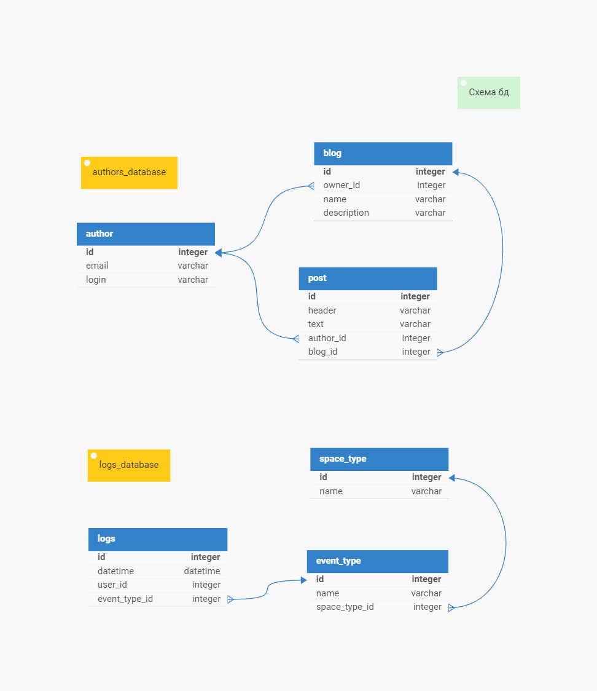

# Farpost Python Test Task
Этот проект представляет собой тестовое задание на Python для компании Farpost.

**Текущий прогресс: 100%**

## Установка и запуск
Для запуска PostgreSQL и миграций Liquibase используйте следующую команду:
```commandline
docker-compose up
```

Запуск скрипта, который формирует csv-файлы.
```commandline
python main.py
```

## Ход работы (рассуждения)
### Пункты 1,2,3
Для создания бд я решил использовать PostgreSQL и Liquibase для управления миграциями. 
#### Замечание
Я считаю, что у второй бд неправильная структура, а именно неправильно выстроены связи между 
сущностями. 
Так как _event_type_ зависит от _space_type_. 
Каждому _event_type_ соответствует свой _space_type_.
**Структура из тз:**
- _logs_ Many-to-One _space_type_
- _logs_ Many-to-One _event_type_

**Правильная структура**
- _logs_ Many-to-One _event_type_
- _event_type_ Many-to-One _space_type_
<br>
<br>
Новая схема бд приложена ниже.

### Пункт 4
Отчёты хранятся в папке: _output_directory_
#### comments.csv -> post.csv
Отчёт `comments.csv` не получится создать в том виде, который требуется в тз. 
Так как хоть в логи (вторая бд) и сохраняется информация о оставленных пользователем комментариях, 
но эти логи никак не связаны с постами. Поэтому получится узнать только общее кол-во комментариев, 
которые оставил пользователь. Без привязки к постам.

Вместо этого отчёта создаю отчёт **_post.csv_** с постами, которые написал пользователь.
Поля отчёта:
- author_id (id автора поста)
- author_login (login автора поста)
- blog_name (название блога)
- blog_owner_id (id владельца блога)
- blog.owner_id->author.login AS blog_owner_login (login владельца блога)
- post.header AS post_header (заголовок поста)

#### general.csv
Отчёт `general.csv` можно создать в полном объёме. 
Единственный момент в бд с логами нет логина пользователя, 
но его можно получить через _user_id_ из _authors_database_. + думаю, что будет не лишним добавить в 
.csv поля _user_id_ и _login_.

## Дополнение
Написал тесты для:
- [ReportCreator](report_creator.py)

## Схема бд

